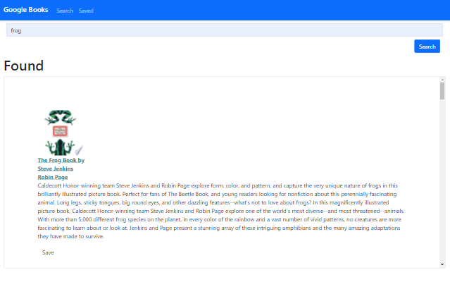
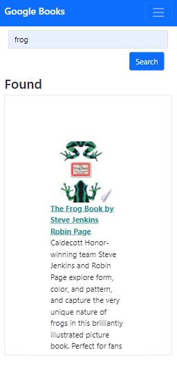

#  Google Books Search

This is a React-based app that searches for books using the Google Books API.  You can save your searches to MongoDB for future reference.

 
 

## Table of Contents

* [Installation](#Installation)
* [Usage](#Usage)
* [License](#License)
* [Contributing](#Contributing)
* [Tests](#Tests)
* [Questions](#Questions)

 
 

## Installation

Browse to: https://google-book-search21.herokuapp.com/

 
 

## Usage

Type a search term in the search box and click 'Search'.  Then you can click the save button on each book to save that book to the database.  You can also view and delete saved books on the 'saved books' page.

 
 

## Screenshot Desktop

 
 

## Screenshot Mobile

 
 

## License

[GNU GPLv3](https://choosealicense.com/licenses/gpl-3.0/)

 
 

## Contributing

Please open an issue in GitHub if you would like to contribute.  Feel free to fork the repo.

 
 

## Tests

No tests have been written.

 
 

## Questions  

If you have questions about the project you can email me, or you can open an issue in the GitHub repository.

My GitHub profile is [BenjDG](https://github.com/BenjDG)  
  
Email: bdgalloway85@gmail.com.  
